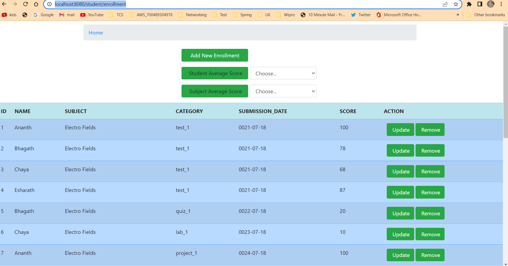

# Student Ratings Web Application

# Description

This is a Web Application which displays a form containing student enrollments.
All the Data specific to enrollment is stored in H2 DB which in memory Database.

It covers following Scenario:

1) Compute & display student average score per assignment category &overall rating for assigned subject(s).
2) Compute & Display subject average score per assignment category &overall rating for assigned student(s).
3) Basic features.

    1) Display assignment category with weights to an existing list.
    2) Display all assignment categories with their weights.
    3) CRUD operations for student enrollment to subject(s)with Assignment Category (Default values for date of
       submission and Point)

### Running Application Steps

1) mvn clean install -U
2) java -jar ./target/SU20343138_WebApp_Rating-0.0.1-SNAPSHOT.jar
3) Open http://localhost:8080/. It will Land on index page, just click 'Show Student Enrollment'.

Refer the Screen shot for example output:

